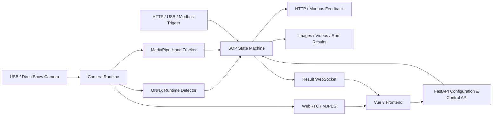
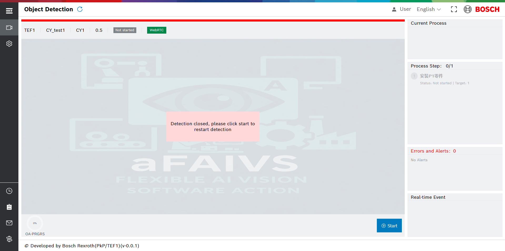

[English](./README.md) | [简体中文](./README.zh-CN.md)

# FAIVS-A

<p align="center">
	
</p>

<p align="center">
	<strong>Flexible AI Vision Software for Action</strong><br />
	Real-time, SOP-driven industrial action inspection with configurable automation integration.
</p>


FAIVS-A is an industrial AI vision application for guiding and validating operator actions. It combines ONNX object detection, MediaPipe hand tracking, camera streaming, and a configurable SOP state machine to monitor whether objects move through the expected source, transit, and target regions.

This repository contains both runtime layers:

- `dev-backend`: FastAPI service for cameras, inference, SOP execution, triggers, result media, configuration, and logs.
- `dev-frontend`: Vue 3 application for live detection, SOP authoring, camera/model setup, integrations, and bilingual operation.

> This repository is the **Action** edition of FAIVS. It focuses on runtime inspection and SOP configuration; dataset labeling and model training are outside this repository's current scope.

## Quick Navigation

- [Overview](#overview)
- [Architecture](#architecture)
- [Detection Workflow](#detection-workflow)
- [Core Features](#core-features)
- [Repository Structure](#repository-structure)
- [Requirements](#requirements)
- [Quick Start](#quick-start)
- [Model and SOP Setup](#model-and-sop-setup)
- [Configuration](#configuration)
- [Result Storage](#result-storage)
- [Build](#build)
- [Screenshots](#screenshots)
- [API Reference](#api-reference)
- [Troubleshooting](#troubleshooting)
- [Security and Deployment Notes](#security-and-deployment-notes)

## Overview

FAIVS-A currently provides:

- Named camera discovery, preview, resolution, crop area, and clarity configuration.
- Validated ZIP model-package upload, atomic installation/overwrite, and label/color metadata stored in `cache.json`.
- Encrypted export and validated JSON/encrypted import for main and SOP configuration files.
- SOP creation, editing, activation, deletion, and model reuse across SOPs.
- Object movement validation through source, transit, and target stages.
- Manual fixed regions that can be referenced safely by SOP steps.
- MediaPipe hand landmarks with configurable left/right rendering styles.
- Start, pause, resume, reset, next-cycle, and full-stop runtime controls.
- WebRTC video delivery with an MJPEG fallback and WebSocket detection results.
- HTTP API, USB scanner, and Modbus-TCP trigger configuration.
- Per-step HTTP/Modbus feedback and global result feedback endpoints.
- Evidence images and NG video clips with asynchronous result storage.
- Local fallback storage and later synchronization when the configured result path returns.
- System log viewing, download, and cleanup.
- Chinese/English user interface switching.

## Architecture



### Technology Stack

| Layer        | Technology                 | Responsibility                           |
| ------------ | -------------------------- | ---------------------------------------- |
| Backend      | FastAPI / Starlette        | APIs, validation, runtime lifecycle      |
| Inference    | ONNX Runtime               | Real-time object detection               |
| Vision       | OpenCV / MediaPipe         | Camera processing and hand tracking      |
| Streaming    | aiortc / WebSocket / MJPEG | Live video and result delivery           |
| Integration  | pymodbus / HTTP            | Industrial triggers and feedback         |
| Frontend     | Vue 3 / Element Plus       | Detection and configuration UI           |
| State / i18n | Pinia / vue-i18n           | Persistent UI state and bilingual text   |
| Build        | Vite                       | Development server and production assets |

## Detection Workflow

1. Select a camera and create or choose an SOP in the configuration page.
2. Associate the SOP with a model folder and configure its confidence threshold.
3. Add ordered steps with expected objects, targets, timeouts, regions, and feedback rules.
4. Start detection manually or trigger it through an external integration.
5. The backend opens the camera, performs ONNX inference and hand tracking, and advances the SOP state machine.
6. The frontend receives live video and runtime snapshots, showing current step, progress, OK/NG counts, timeout, and alerts.
7. On completion or error, configured images/videos and result data are stored; HTTP or Modbus feedback can be emitted.

## Core Features

### 1. SOP-Driven Action Inspection

- Multiple named SOPs can reuse the same model.
- Steps define expected objects, target counts, hints, timeouts, and movement context.
- Source, transit, and target object-detection stages can be enabled independently.
- Miss tolerance, hand margin, selected hand points, `doneWhen`, and `ngWhen` rules support detailed validation.
- Runtime state exposes current step, progress, completion, errors, and operator guidance.

### 2. Model, Camera, and Region Management

- Complete models contain at least one `.onnx` file and a `cache.json` metadata file.
- Training-system ZIP packages can be uploaded and installed without manually copying model files.
- Archive paths, size, compression ratio, content, filename, and labeling metadata are validated before installation.
- Existing models are overwritten only after explicit confirmation, using staged installation and automatic rollback protection.
- Label names and display colors are maintained through model metadata.
- DirectShow cameras can be discovered, previewed, and configured per device.
- Fixed manual regions use stable IDs and are protected while referenced by SOP steps.
- Detection boxes, region fills, and left/right hand landmarks are fully configurable.

### 3. Live Runtime and Streaming

- Start, pause, resume, reset, next-cycle, and full-stop controls.
- Reset returns the SOP to its first step while keeping camera and streaming resources alive.
- WebRTC is the primary stream, with MJPEG as a compatibility fallback.
- A result WebSocket publishes detector snapshots and runtime state while detection is active.

### 4. Automation Integration

- HTTP trigger with configurable query-parameter names.
- USB scanner trigger with minimum/maximum payload length.
- Modbus-TCP triggers using coils, discrete inputs, holding registers, or input registers.
- External start by serial number, SOP name, and camera name without the UI Start button.
- Global and per-step HTTP/Modbus result feedback.

### 5. Results and Operations

- Save operation-error, NG raw, NG annotated, successful-step, and completed-run images.
- Save configurable pre/post-event NG video clips.
- Fall back to local storage if a configured result path is unavailable, then synchronize later.
- View, download, and clear rotating application logs.

## Repository Structure

```text
aFAIVS/
├─ README.md                    # default English documentation
├─ README.zh-CN.md              # Simplified Chinese documentation
├─ dev-backend/
│  ├─ main_dev.py               # FastAPI development entry
│  ├─ requirements.txt          # Python dependencies (UTF-16 encoded)
│  ├─ run.txt                   # backend startup commands
│  ├─ lib/
│  │  └─ hand_landmarker.task   # MediaPipe hand model
│  ├─ models/                   # <model>/*.onnx + cache.json
│  ├─ module/                   # runtime and domain implementation
│  │  ├─ _detector.py           # detection runtime orchestration
│  │  ├─ _onnx_detection.py     # ONNX inference
│  │  ├─ _hand_detection.py     # hand tracking
│  │  ├─ _sop_state_machine.py  # SOP execution state
│  │  ├─ _trigger.py            # HTTP/USB/Modbus triggers
│  │  ├─ _step_feedback.py      # result feedback
│  │  ├─ _model_archive.py      # secure model package validation/installation
│  │  ├─ _config_encryptor.py   # configuration encryption compatibility
│  │  └─ _result_storage.py     # persistence and synchronization
│  ├─ views/                    # FastAPI route modules
│  ├─ static/
│  │  ├─ config.json            # main application configuration
│  │  └─ sop_config.json        # SOP definitions
│  ├─ results/                  # default result directory
│  └─ logs/                     # rotating application logs
└─ dev-frontend/
	 ├─ package.json
	 ├─ vite.config.js
	 └─ src/
			├─ api/                   # Axios API wrappers
			├─ components/            # SOP and configuration dialogs
			├─ lang/                  # Chinese/English messages
			├─ stores/                # Pinia state
			├─ views/                 # Detection, Configuration, Logs
			└─ assets/                # styles, fonts, and images
```

## Requirements

- Windows 10 or Windows 11
- Python 3.10+
- Node.js 18+
- npm 9+
- A DirectShow-compatible camera
- Optional: Modbus-TCP device or simulator
- Optional: USB barcode/QR scanner for trigger testing

The camera layer currently uses Windows DirectShow (`cv2.CAP_DSHOW`) and Windows device enumeration, so other operating systems require code adaptation.

## Quick Start

### 1. Clone the Repository

```powershell
git clone <repository-url>
cd aFAIVS
```

### 2. Start the Backend

```powershell
cd dev-backend
python -m venv .venv
.\.venv\Scripts\Activate.ps1
python -m pip install --upgrade pip
pip install -r requirements.txt
uvicorn main_dev:app --host 0.0.0.0 --port 20253 --reload
```

Backend URLs:

```text
API:      http://127.0.0.1:20253
Swagger:  http://127.0.0.1:20253/docs
```

> `dev-backend/requirements.txt` is UTF-16 encoded. Preserve its encoding when editing it.

### 3. Start the Frontend

Open another terminal:

```powershell
cd dev-frontend
npm install
npm run dev
```

Open the local URL printed by Vite. The frontend API base URL is currently configured as `http://127.0.0.1:20253` in `dev-frontend/src/api/index.js`.

## Model and SOP Setup

### Model Folder

Each model uses its own folder:

```text
dev-backend/models/
└─ ExampleModel/
	 ├─ best.onnx
	 └─ cache.json
```

The `cache.json` file must contain the labeling metadata expected by the application. Model folders can be relocated through Path Configuration.

### Uploading a Model Package

Open **Configuration**, click **Upload Model Package**, then select or drop the ZIP exported by the eFAIVS training system.

The archive filename must follow:

```text
eFAIVSModel{training_name}_{project_name}_YYYYMMDDHHMMSS.zip
```

Example:

```text
eFAIVSModelTraining_CY_20260731123045.zip
```

The `{project_name}` segment becomes the installed model folder name (`CY` in the example). It may contain letters, numbers, underscores, hyphens, and periods, must not exceed 100 characters, and must not be a Windows-reserved name.

Package requirements and protections:

- Compressed upload size: non-empty and no larger than 1 GB.
- Uncompressed content: no larger than 2 GB with a maximum compression ratio of 250:1.
- Contents: exactly one non-empty `.onnx` file and exactly one `cache.json`; no other files.
- `cache.json`: valid UTF-8 JSON object containing a non-empty `labeling` object.
- Unsafe absolute/traversal paths and symbolic links are rejected.
- Upload validation/extraction runs outside the async API event loop, and concurrent installs are serialized.
- Files are extracted to a staging directory and atomically moved into the configured model directory only after all checks pass.

If the model already exists, the first request returns `MODEL_ALREADY_EXISTS`. The UI asks for confirmation and retries with `overwrite=true`. During overwrite, the old directory is temporarily renamed and automatically restored if installation fails.

### SOP Definition

SOP definitions are keyed by name in `static/sop_config.json`. A simplified example:

```json
{
	"Example_SOP": {
		"model": "ExampleModel",
		"confidence": 0.5,
		"steps": [
			{
				"id": 1,
				"name": "Install part P1",
				"type": "p_object",
				"hint": "Pick up P1 and place it in the target",
				"target": 1,
				"timeout": 30,
				"context": {
					"expectedObject": "P1",
					"fromRegion": "",
					"toRegion": "Target",
					"objectDetection": {
						"source": true,
						"transit": true,
						"target": true
					},
					"missTolerance": 5,
					"handMargin": 5
				},
				"doneWhen": [],
				"ngWhen": []
			}
		],
		"enabled": true
	}
}
```

Use the configuration UI for normal editing. It validates model existence, manual-region references, feedback settings, and SOP names before writing the file.

## Configuration

### Main Configuration

`dev-backend/static/config.json` contains:

| Section                  | Purpose                                                               |
| ------------------------ | --------------------------------------------------------------------- |
| `paths`                | Model, SOP, and result directories; optional detection-dataset saving |
| `resolutions`          | Resolutions offered by the configuration UI                           |
| `cameraResolution`     | Per-camera width, height, display area, and clarity                   |
| `boxStyle`             | Detection box, text, and region-fill rendering                        |
| `handStyle`            | Left/right hand landmarks and skeleton rendering                      |
| `manualRegions`        | Fixed regions grouped by camera                                       |
| `resultMedia`          | Evidence images, NG clips, quality, queue, and disk limits            |
| `modbus`               | Default Modbus-TCP host, port, and timeout                            |
| `detectionIntegration` | Trigger methods and global result feedback endpoints                  |

Missing fields are merged from backend defaults without overwriting existing values.

### Configuration Import and Export

Open **Configuration > Configuration File Import/Export** to transfer either of the two managed files:

| Type | Active file | Download name | Content |
| --- | --- | --- | --- |
| `main` | `static/config.json` | `config.enc` | Paths, cameras, styles, integrations, regions, and result-media settings |
| `sop` | Configured SOP path + `sop_config.json` | `sop_config.enc` | All named SOP definitions and steps |

#### Export

- Downloads are always encrypted `.enc` files using the training-system-compatible `aes_like` format.
- The encrypted package contains the configuration data plus encryption time, method, version, and original filename metadata.
- The server creates a temporary encrypted file and removes it after the response completes.

#### Import

- Accepted files: UTF-8/UTF-8-BOM `.json` or compatible `.enc` files.
- Maximum size: 10 MB; empty files are rejected.
- The selected UI card determines the target type (`main` or `sop`); the uploaded filename does not select the target.
- Encrypted files must use the same password and salt as this system.
- Validation completes before the active file is changed.

Main configuration import starts from current application defaults, accepts only supported keys, fills missing values, and validates paths/types, resolutions, per-camera settings, styles, fixed regions, integrations, and result-media settings. SOP import requires an object of named SOPs, valid names, a model name and step array for each SOP, valid region/feedback references, and no more than one enabled SOP. Import validates the model field but does not require every referenced model folder to be present on the receiving machine.

Before replacement, the existing active file is copied to:

```text
dev-backend/backup/config_import/
```

The new JSON is written to a temporary file in the target directory, flushed to disk, and atomically replaced with `os.replace`. The API response reports whether a backup was created and its filename.

#### Encryption Settings

Set matching secrets in the backend environment when transferring encrypted configuration between systems:

```powershell
$env:CONFIG_ENCRYPTION_PASSWORD = "<shared-password>"
$env:CONFIG_ENCRYPTION_SALT = "<shared-salt>"
```

Both variables must match the exporting/training system. Configure them before backend startup; do not commit production values to the repository.

## Result Storage

FAIVS-A stores structured production history and evidence media. It does **not** store every detection frame. Storage is managed by `SOPResultStore`, `ResultMediaRecorder`, and the local synchronization service.

### Stored Data

Each product execution creates a Run with a unique `run_id`. A reset keeps the same `session_id` but starts a new Run and increments `attempt_no`.

| Record | SQLite table       | Content                                                                                                      |
| ------ | ------------------ | ------------------------------------------------------------------------------------------------------------ |
| Run    | `sop_runs`       | SOP/model/camera/operator, trigger, start/end time, execution and quality status, durations, NG/reset counts |
| Step   | `sop_step_runs`  | Expected object/regions, target/completed count, timing, retries, NG count, result                           |
| Cycle  | `sop_cycle_runs` | One object movement cycle, pickup/transit/placement timestamps and durations                                 |
| Event  | `sop_events`     | Start, finish, pause, resume, block, NG, and step events with severity and JSON details                      |
| Media  | `sop_media`      | Evidence path, type, purpose, dimensions, duration/FPS, size, SHA-256, and storage status                    |

Runs finish with an `execution_status` such as `completed` or `interrupted`. Their `quality_status` is calculated as `ok`, `with_deviation`, or `incomplete` according to completion and NG count.

### Database Field Reference

SQLite uses dynamic typing, but the declared types below are the application schema types. All `*_at_ms` timestamps are Unix epoch milliseconds; all `*_duration_ms` values are elapsed milliseconds. JSON fields contain compact UTF-8 JSON text rather than separate child tables.

#### Catalog Database: `sop_catalog.db`

##### `sop_run_catalog`

| Field(s) | Type | Description |
| --- | --- | --- |
| `run_id` | TEXT, PK | Globally unique Run identifier (`RUN_<uuid>`). |
| `storage_file` | TEXT, required | Relative monthly database path containing the complete Run, for example `history/sop_history_2026-07.db`. |
| `project_name`, `sop_name` | TEXT | Model project and SOP definition names used by the Run. |
| `model_name`, `camera_name` | TEXT | ONNX filename and camera display name. |
| `external_reference` | TEXT | External serial number/reference, when supplied by an external trigger. |
| `started_at_ms`, `ended_at_ms` | INTEGER | Run start and optional completion timestamps. |
| `execution_status` | TEXT, required | Runtime outcome, such as `running`, `completed`, `interrupted`, or another termination status. |
| `quality_status` | TEXT, required | Calculated quality: `ok`, `with_deviation`, or `incomplete`. |
| `media_count`, `ng_media_count` | INTEGER | Total available evidence count and operation-error evidence count. |
| `has_media` | INTEGER | SQLite boolean (`0`/`1`) indicating whether available media exists. |
| `cover_media_id` | TEXT | Preferred preview media ID; completed-Run evidence takes priority when available. |

Indexes are provided for `started_at_ms`, `external_reference`, and `sop_name` to support history filtering without opening every monthly database.

##### `catalog_metadata`

| Field | Type | Description |
| --- | --- | --- |
| `key` | TEXT, PK | Metadata/migration key. |
| `value` | TEXT | Metadata value. |
| `updated_at_ms` | INTEGER, required | Last update time. |

This table currently records one-time catalog migrations, including registration of the legacy `sop_history.db` file.

#### Monthly History Database: `history/sop_history_YYYY-MM.db`

##### `sop_runs`

| Field(s) | Type | Description |
| --- | --- | --- |
| `run_id` | TEXT, PK | Unique execution identifier and parent key for all Run records. |
| `session_id` | TEXT, required | Product/session identifier shared across reset attempts. |
| `attempt_no` | INTEGER, required | Attempt number within the session; increments after reset. |
| `project_name`, `sop_name`, `sop_version` | TEXT | Project/model group, SOP name, and optional SOP version. |
| `sop_config_hash` | TEXT | SHA-256 of the exact SOP configuration used for traceability. |
| `sop_config_json` | TEXT | Full SOP configuration snapshot used by this Run. |
| `model_name`, `camera_name` | TEXT | ONNX model filename and camera display name. |
| `operator_name`, `station_name` | TEXT | Windows display name and machine hostname. |
| `trigger_source` | TEXT | Start source, for example `manual` or an external integration. |
| `trigger_payload_json` | TEXT | JSON snapshot of trigger parameters. |
| `external_reference` | TEXT | External product serial number/reference. |
| `started_at_ms`, `ended_at_ms` | INTEGER | Start and optional end timestamps. |
| `execution_status` | TEXT, required | Current/final execution state. |
| `quality_status` | TEXT, required | `ok`, `with_deviation`, or `incomplete`. |
| `total_duration_ms` | INTEGER | Wall-clock duration from start to finish. |
| `active_duration_ms` | INTEGER | Total duration excluding paused and blocked time. |
| `paused_duration_ms`, `blocked_duration_ms` | INTEGER | Accumulated pause and blocked durations. |
| `ng_count`, `reset_count` | INTEGER | Run-level NG and reset totals. |
| `last_step_id` | INTEGER | Last/current SOP step identifier. |
| `last_reason` | TEXT | Latest completion, interruption, or error reason. |

##### `sop_step_runs`

| Field(s) | Type | Description |
| --- | --- | --- |
| `step_run_id` | TEXT, PK | Unique execution record for one SOP step. |
| `run_id` | TEXT, FK | Parent `sop_runs.run_id`. |
| `step_id`, `step_order` | INTEGER | SOP step identifier and ordered position. |
| `step_name` | TEXT | Step display name captured at runtime. |
| `expected_object` | TEXT | Object label expected by this step. |
| `expected_source`, `expected_target` | TEXT | Serialized source and target region descriptions. |
| `target_count`, `completed_count` | INTEGER | Required and successfully completed cycle counts. |
| `started_at_ms`, `completed_at_ms` | INTEGER | Step start and optional completion timestamps. |
| `total_duration_ms` | INTEGER | Step wall-clock duration. |
| `paused_duration_ms`, `blocked_duration_ms` | INTEGER | Pause and blocked time accumulated during the step. |
| `retry_count`, `ng_count` | INTEGER | Step retry and NG totals. |
| `result` | TEXT, required | Step state/outcome, for example `running`, `blocked`, `completed`, `interrupted`, or another termination status. |

##### `sop_cycle_runs`

| Field(s) | Type | Description |
| --- | --- | --- |
| `cycle_run_id` | TEXT, PK | Unique object-movement cycle identifier. |
| `run_id` | TEXT, FK | Parent `sop_runs.run_id`. |
| `step_run_id` | TEXT, FK | Parent `sop_step_runs.step_run_id`. |
| `step_id`, `cycle_no` | INTEGER | SOP step identifier and 1-based cycle sequence within the step. |
| `expected_object`, `actual_object` | TEXT | Required object label and observed object label. |
| `expected_source`, `actual_source` | TEXT | Required source and detected source. |
| `expected_target` | TEXT | Required target region. |
| `started_at_ms` | INTEGER | Cycle start timestamp. |
| `pickup_at_ms` | INTEGER | Object pickup timestamp. |
| `source_departed_at_ms` | INTEGER | Timestamp when the object leaves its source. |
| `target_entered_at_ms` | INTEGER | Timestamp when the object enters the target. |
| `released_at_ms`, `completed_at_ms` | INTEGER | Release and cycle completion timestamps. |
| `waiting_to_pick_ms` | INTEGER | Time waiting for pickup. |
| `pickup_duration_ms` | INTEGER | Pickup phase duration. |
| `transit_duration_ms` | INTEGER | Source-to-target movement duration. |
| `placement_duration_ms` | INTEGER | Target placement/release duration. |
| `total_duration_ms` | INTEGER | Full cycle duration. |
| `retry_count`, `ng_count` | INTEGER | Cycle retry and NG totals. |
| `result` | TEXT, required | Cycle state/outcome, for example `running`, `blocked`, `retrying`, `completed`, or a termination status. |

##### `sop_events`

| Field(s) | Type | Description |
| --- | --- | --- |
| `event_id` | INTEGER, PK | Auto-increment event identifier within the monthly database. |
| `run_id` | TEXT, FK | Parent Run. |
| `step_run_id`, `cycle_run_id` | TEXT, optional references | Related step/cycle when the event is not Run-wide. |
| `timestamp_ms` | INTEGER, required | Event occurrence time. |
| `event_type` | TEXT, required | Machine-readable event name, such as `RUN_STARTED`, `STEP_COMPLETED`, or `RUN_FINISHED`. |
| `severity` | TEXT, required | Event severity such as `info`, `warning`, or `error`. |
| `code` | TEXT | Stable event/error code for integrations and analysis. |
| `message` | TEXT | Human-readable event description. |
| `details_json` | TEXT | Event-specific structured details. |

##### `sop_media`

| Field(s) | Type | Description |
| --- | --- | --- |
| `media_id` | TEXT, PK | Unique evidence identifier (`MEDIA_<uuid>`). |
| `run_id` | TEXT, FK | Parent Run. |
| `step_run_id`, `cycle_run_id` | TEXT, optional FKs | Related step and cycle. |
| `event_id` | INTEGER, optional FK | Related `sop_events.event_id`. |
| `captured_at_ms` | INTEGER, required | Original evidence capture/event time. |
| `media_type` | TEXT, required | `image` or `video`. |
| `purpose` | TEXT, required | Evidence purpose: `operation_error`, `step_success`, or `run_completed`. |
| `variant` | TEXT, required | `raw`, `annotated`, or `event_clip`. |
| `relative_path` | TEXT, required | Forward-slash path relative to the result root. |
| `mime_type` | TEXT, required | Currently `image/jpeg` or `video/mp4`. |
| `width`, `height` | INTEGER | Pixel dimensions. |
| `duration_ms` | INTEGER | Video duration; null for images. |
| `fps` | REAL | Video frame rate; null for images. |
| `size_bytes` | INTEGER | Final file size after a successful write. |
| `sha256` | TEXT | SHA-256 digest of the completed file. |
| `storage_status` | TEXT, required | `pending` while queued/writing, `available` after commit, or `failed` after an error. |
| `error_message` | TEXT | Media write/encode error, truncated to 1,000 characters. |
| `created_at_ms`, `available_at_ms` | INTEGER | Database reservation and successful availability times. |
| `deleted_at_ms` | INTEGER | Reserved logical-deletion timestamp; currently nullable. |

Foreign-key checking is enabled for monthly databases. WAL mode and a 5-second busy timeout allow result and media workers to write concurrently. Indexed fields include Run start time, child `run_id` references, event type, media event reference, and media storage status.

### Result Directory Layout

```text
<active-result-root>/
├─ sop_catalog.db                         # fast cross-month Run index
├─ history/
│  ├─ sop_history_2026-07.db              # monthly production history
│  └─ sop_history_2026-08.db
└─ media/
	└─ 2026/
		└─ 07/
			└─ RUN_<uuid>/
				├─ images/
				│  ├─ MEDIA_<uuid>_operation_error_raw.jpg
				│  ├─ MEDIA_<uuid>_operation_error_annotated.jpg
				│  ├─ MEDIA_<uuid>_step_success_annotated.jpg
				│  └─ MEDIA_<uuid>_run_completed_annotated.jpg
				└─ clips/
					└─ MEDIA_<uuid>_operation_error_event_clip.mp4
```

`sop_catalog.db` indexes all Runs and points each Run to its monthly history database. Existing legacy `sop_history.db` data is registered in the catalog without moving or modifying the legacy file.

### Evidence Media

Result media is configured by `resultMedia` in `static/config.json` or through **Configuration > Result Media**.

| Option                                             | Description                                        | Default                  |
| -------------------------------------------------- | -------------------------------------------------- | ------------------------ |
| `enabled`                                        | Enable asynchronous evidence recording             | `true`                 |
| `saveOperationError`                             | Capture configured evidence for operation errors   | `true`                 |
| `saveNgRawImage`                                 | Save an unannotated NG JPEG                        | `true`                 |
| `saveNgAnnotatedImage`                           | Save an annotated NG JPEG                          | `true`                 |
| `saveStepSuccess`                                | Save an annotated image when a step completes      | `true`                 |
| `saveRunCompleted`                               | Save the final annotated image for a completed Run | `true`                 |
| `saveNgVideo`                                    | Save an MP4 clip around an NG event                | `true`                 |
| `ngVideoBeforeSeconds` / `ngVideoAfterSeconds` | Pre/post-event clip window                         | `8` / `5` seconds    |
| `ngVideoFps` / `ngVideoMaxWidth`               | Clip sample rate and maximum width                 | `10` FPS / `1280` px |
| `jpegQuality`                                    | Evidence JPEG quality                              | `90`                   |
| `minFreeDiskPercent`                             | Stop media writes below this free-space percentage | `10`                   |
| `queueSize`                                      | Asynchronous media task queue limit                | `32`                   |

Images and clips are written outside the detector thread. Files are first written as temporary `.part` files and then atomically renamed. Successful media records include byte size and SHA-256; failures are retained in SQLite with `storage_status = 'failed'` and an error message. FFmpeg is preferred for MP4 encoding when available, with OpenCV as fallback.

### Active Path and Local Spool Rules

The configured destination comes from `paths.resultPath`:

- When it equals the built-in `dev-backend/results` path and is writable, Runs are stored there directly.
- Any custom destination, including another local directory, removable drive, mapped drive, or UNC/NAS path, uses `dev-backend/local_results` as the active spool.
- If the built-in result directory cannot be written within the storage probe timeout, the system also falls back to `local_results`.
- The probe creates, flushes, and deletes a temporary file; directory existence alone is not treated as writable.

Using a local spool for custom paths prevents a disappearing network share or removable disk from corrupting an active production Run.

### Synchronization Behavior

Synchronization is requested automatically after a Run finishes and its media writer becomes idle. It can also be started manually from Configuration or through `POST /result_storage/sync`.

A Run is synchronized only when:

- Its execution status is no longer `running`.
- No associated media row remains in `pending` state.
- The configured destination passes a real write probe.

For each Run, available media files are copied atomically, the monthly SQLite schema/data and catalog row are committed at the destination, and only then are local database rows and files removed. A failed Run remains in the local spool for retry; one failure does not stop other eligible Runs from synchronizing.

Storage status is available from `GET /result_storage/status` and includes:

- Configured and local paths.
- Destination availability and error message.
- Whether synchronization is in progress.
- Pending Run count, media count, and total local bytes.

> Do not manually delete `sop_catalog.db`, monthly history databases, or media files independently. Their IDs and relative paths form one consistent result set. Use the application synchronization workflow when moving fallback data.

## Build

Build production frontend assets:

```powershell
cd dev-frontend
npm install
npm run build
```

Preview the production build:

```powershell
npm run preview
```

The package manifest includes Electron tooling and `start`/`make` scripts. This checkout does not include the declared Electron `main.js` entry, so Electron execution or packaging requires that entry and its integration files to be restored first.

## Screenshots

System interface:



## API Reference

Base URL: `http://127.0.0.1:20253`

### Runtime Control

| Method | Endpoint                        | Purpose                                         |
| ------ | ------------------------------- | ----------------------------------------------- |
| GET    | `/detection/start_detection`  | Start a named SOP with a selected camera        |
| GET    | `/detection/pause_detection`  | Pause active detection                          |
| GET    | `/detection/resume_detection` | Resume paused detection                         |
| POST   | `/detection/reset_detection`  | Reset SOP while keeping runtime resources alive |
| GET    | `/detection/stop_detection`   | Stop detection and release resources            |
| GET    | `/detection/status`           | Read runtime and external-start status          |

### Streaming and Results

| Method | Endpoint                     | Purpose                                         |
| ------ | ---------------------------- | ----------------------------------------------- |
| POST   | `/detection/webrtc/offer`  | Exchange WebRTC SDP offer/answer                |
| GET    | `/detection/server-stream` | MJPEG fallback stream                           |
| WS     | `/detection/ws/result`     | Detection snapshots and runtime status          |
| WS     | `/ws/video_streaming`      | Camera preview for configuration/manual regions |

### External Triggers

| Method | Endpoint                      | Purpose                                                         |
| ------ | ----------------------------- | --------------------------------------------------------------- |
| GET    | `/detection/trigger/http`   | Trigger a configured running runtime using query parameters     |
| GET    | `/detection/external/start` | Start/reuse runtime using`SN`, `SOP_NAME`, and `CAP_NAME` |
| POST   | `/modbus/test_connection`   | Test Modbus-TCP connectivity                                    |

External start example:

```text
GET /detection/external/start?SN=PART-0001&SOP_NAME=Example_SOP&CAP_NAME=CameraName
```

### Models, SOPs, and Configuration

| Method      | Endpoint                                             | Purpose                                  |
| ----------- | ---------------------------------------------------- | ---------------------------------------- |
| GET         | `/get_config`                                      | Read main and SOP configuration          |
| GET         | `/get_device`                                      | List available cameras                   |
| GET         | `/get_models`                                      | List models and completeness status      |
| POST        | `/models/upload?overwrite=false`                   | Validate and install a model ZIP package |
| GET/POST    | `/model/labels`, `/model/labels/set`             | Read or update label colors              |
| GET         | `/config-files/{config_type}/download`            | Download encrypted `main` or `sop` configuration |
| POST        | `/config-files/{config_type}/upload`              | Import JSON/encrypted `main` or `sop` configuration |
| POST/DELETE | `/manual_regions/save`, `/manual_regions/delete` | Maintain fixed regions                   |
| POST        | `/set_sop_config`                                  | Create an SOP                            |
| POST        | `/update_sop_config`                               | Update SOP fields                        |
| DELETE      | `/delete_sop_config`                               | Delete an SOP                            |
| POST        | `/modify_config`                                   | Update validated common configuration    |
| GET/POST    | `/result_storage/status`, `/result_storage/sync` | Inspect and synchronize fallback results |

### Logs

| Method | Endpoint                    | Purpose                           |
| ------ | --------------------------- | --------------------------------- |
| GET    | `/sys/error_log`          | Parse and return application logs |
| GET    | `/sys/error_log/download` | Download the log file             |
| GET    | `/sys/error_log/clear`    | Clear the log file                |

## Troubleshooting

### Frontend Cannot Reach the Backend

- Confirm Uvicorn is listening on port `20253`.
- Confirm `base_url` in `dev-frontend/src/api/index.js` matches the backend address.
- For a frontend on another computer, replace `127.0.0.1` with the backend host and review firewall rules.

### Camera Is Missing or Unavailable

- Close applications that may already own the camera.
- Check Windows camera permissions and the device driver.
- Confirm the camera name returned by `/get_device` matches the saved configuration.
- Disconnect active preview streams before detection if the camera cannot be opened twice.

### Model Is Reported as Incomplete

- Confirm the model folder contains an `.onnx` file and `cache.json`.
- Confirm the configured model path points to the expected directory.
- Validate that `cache.json` contains non-empty `labeling` metadata.

### Model Package Upload Fails

- Confirm the filename follows `eFAIVSModel{training_name}_{project_name}_YYYYMMDDHHMMSS.zip`.
- Confirm the package contains exactly one `.onnx` file and one `cache.json`, with no extra files.
- Confirm `cache.json` is UTF-8 JSON with a non-empty `labeling` object.
- Check compressed/uncompressed size and compression-ratio limits.
- If `MODEL_ALREADY_EXISTS` is returned, approve overwrite in the UI only after confirming the target model.

### Configuration Import Fails

- Confirm the file is `.json` or `.enc`, non-empty, and no larger than 10 MB.
- For `.enc`, confirm `CONFIG_ENCRYPTION_PASSWORD` and `CONFIG_ENCRYPTION_SALT` match the source system.
- Import main and SOP files using their matching cards; choosing the wrong type validates against the wrong schema.
- For SOP imports, confirm at most one SOP is enabled and all manual-region/feedback references exist in the current main configuration.
- Check `dev-backend/logs/app.log` for the exact validation error; the active file is not replaced when validation fails.

### Video Falls Back to MJPEG

- WebRTC negotiation may fail because of browser or network policy.
- Check backend logs for SDP or peer-connection errors.
- MJPEG is an intentional compatibility fallback; results continue through WebSocket.

### Modbus Trigger or Feedback Fails

- Test connectivity through `/modbus/test_connection` first.
- Verify host, port, slave address, data type, address, and trigger value.
- Confirm firewalls permit Modbus TCP traffic, commonly on port `502`.

### Results Remain in Local Fallback Storage

- Restore the configured result path or network share.
- Check path permissions for the account running the backend.
- Use result synchronization in Configuration after the target becomes available.

## Security and Deployment Notes

- The development backend currently allows all CORS origins. Restrict `allow_origins` before network or production deployment.
- The API does not currently enforce authentication or authorization. Place it behind a trusted network boundary or add access control.
- Do not expose Modbus devices or trigger endpoints directly to untrusted networks.
- Review result paths, disk limits, log retention, and camera permissions before site deployment.
- Model files and production configuration may contain proprietary data; define repository and artifact policies accordingly.
- Replace the built-in configuration encryption password/salt through environment variables before production use. The compatible `aes_like` format is application-level obfuscation/integrity checking, not a substitute for authenticated modern encryption or secure transport.
- Protect model/configuration upload endpoints with authentication, authorization, HTTPS, and request-rate controls before exposing them outside a trusted network.

## License

No open-source license is currently included. Unless a license is added, this repository should be treated as all rights reserved.
